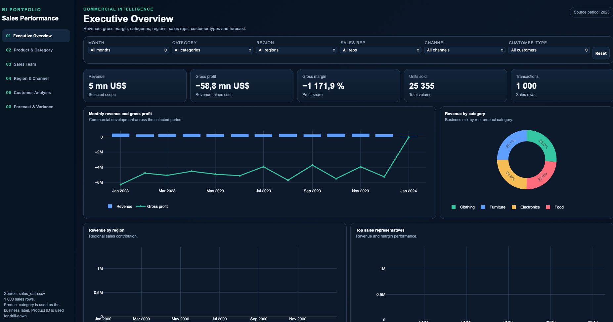
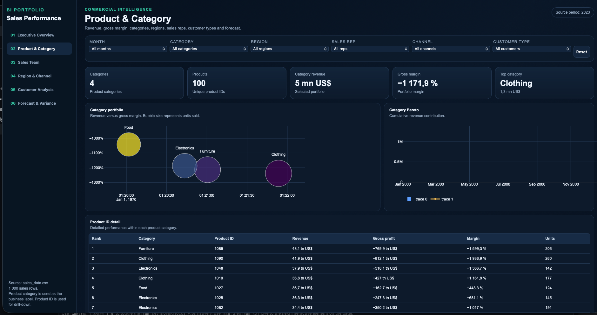
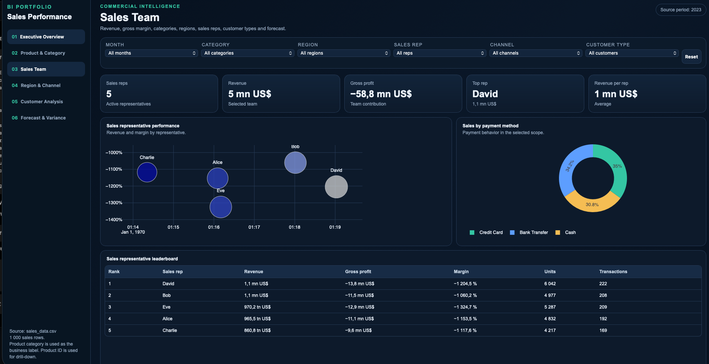
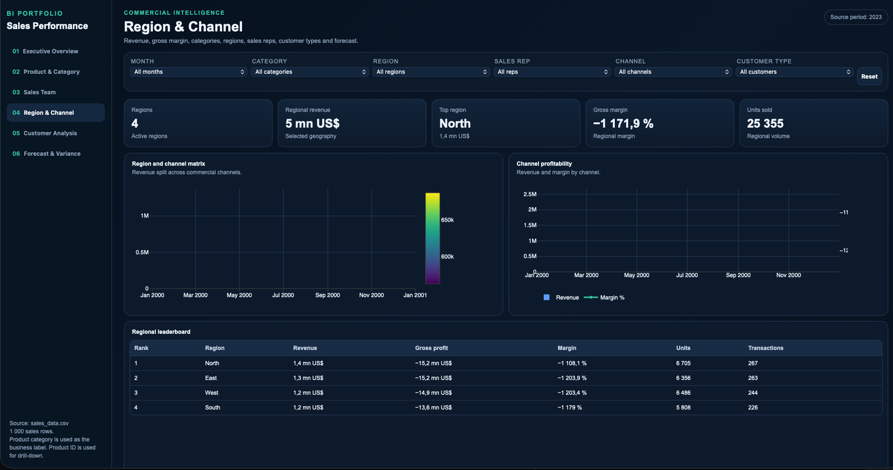
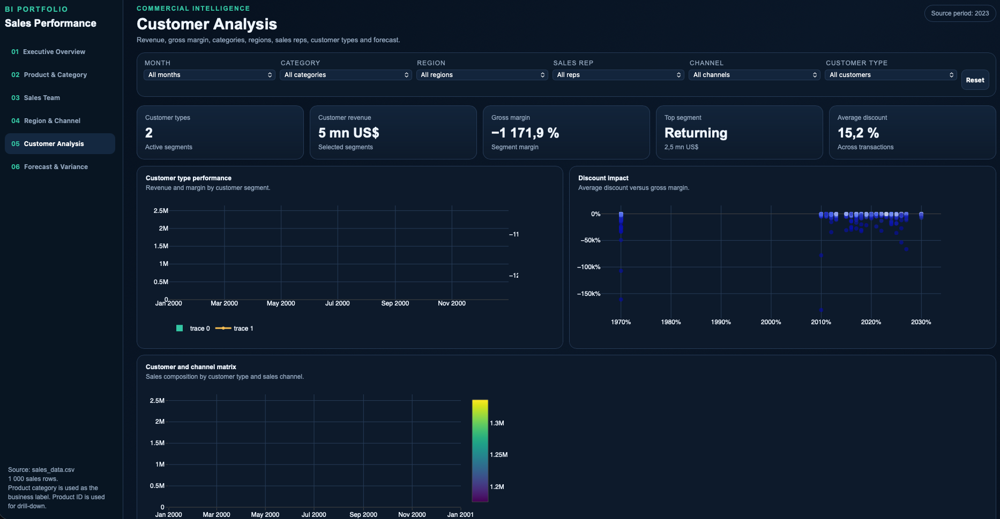
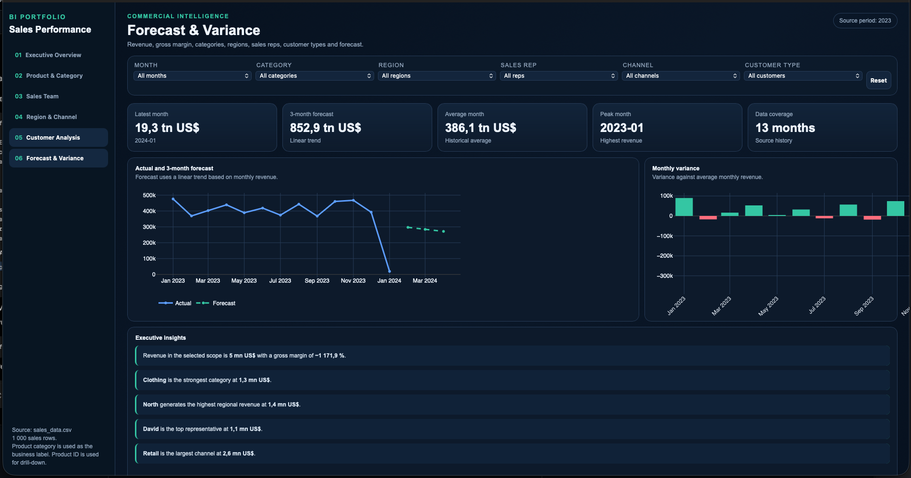

# Sales Performance Dashboard

An interactive Business Intelligence dashboard built to analyze sales performance, profitability and business trends through executive reporting.



---

# Overview

This project demonstrates how Business Intelligence transforms transactional sales data into actionable business insights.

The dashboard enables decision-makers to monitor sales performance, profitability, customer behavior and regional trends through interactive visualizations and KPI-driven reporting.

The solution follows modern Business Intelligence design principles with a strong focus on usability, executive reporting and interactive analytics.

---

# Business Objectives

This dashboard helps answer key business questions such as:

- How is revenue changing over time?
- Which product categories generate the highest revenue?
- Which regions perform best?
- Which sales representatives generate the strongest results?
- Which customer segments are the most valuable?
- How do discounts impact profitability?
- What sales trends can be expected?

---

# Dashboard Pages

## Executive Overview

Provides an executive summary of overall business performance.

Features

- Revenue
- Gross Profit
- Gross Margin
- Units Sold
- Transactions
- Monthly Revenue Trend
- Revenue by Category
- Revenue by Region
- Top Sales Representatives

---

## Product Analysis

Analyze sales performance across product categories.

Features

- Revenue by Category
- Gross Margin Analysis
- Product Ranking
- Pareto Analysis
- Product Performance

---

## Sales Team

Monitor sales representative performance.

Features

- Revenue by Sales Representative
- Gross Profit Analysis
- Payment Method Distribution
- Sales Leaderboard

---

## Regional Analysis

Evaluate sales performance across geographical regions.

Features

- Regional Revenue
- Sales Channel Performance
- Revenue Distribution
- Regional Ranking

---

## Customer Analysis

Understand customer purchasing behaviour.

Features

- Customer Segmentation
- Customer Type Analysis
- Discount Analysis
- Sales Channel Comparison

---

## Forecast & Variance

Support business planning through forecasting and variance analysis.

Features

- Revenue Forecast
- Monthly Trend Analysis
- Variance Analysis
- Executive Insights

---

# Dashboard Screenshots

## Executive Overview


## Product Analysis



## Sales Team



## Regional Analysis



## Customer Analysis



## Forecast & Variance



---

# Key Performance Indicators

| KPI | Description |
|------|-------------|
| Revenue | Total sales revenue |
| Gross Profit | Revenue minus cost |
| Gross Margin | Gross Profit divided by Revenue |
| Units Sold | Total quantity sold |
| Transactions | Number of completed sales |
| Forecast | Projected revenue trend |

---

# Business Intelligence Skills Demonstrated

- Business Intelligence Reporting
- Executive Dashboard Design
- KPI Development
- Sales Analytics
- Customer Analytics
- Product Performance Analysis
- Regional Analytics
- Forecasting
- Variance Analysis
- Interactive Dashboards
- Data Visualization
- Business Storytelling

---

# Technical Skills

- Python
- Pandas
- Plotly
- HTML5
- CSS3
- JavaScript

---

# Dataset

The project uses a transactional sales dataset containing:

- Sales Transactions
- Product Categories
- Sales Representatives
- Customer Types
- Regions
- Sales Channels
- Payment Methods
- Revenue
- Cost
- Quantity Sold
- Discounts

---

# Repository Structure

```text
Sales-Performance-Dashboard
│
├── README.md
├── dashboard
│   └── sales_performance_dashboard.html
│
├── data
│   └── sales_data.csv
│
├── images
│   ├── dashboard-overview.png
│   ├── product-analysis.png
│   ├── sales-team.png
│   ├── regional-analysis.png
│   ├── customer-analysis.png
│   └── forecast-variance.png
```

---

# Getting Started

Clone the repository.

```bash
git clone https://github.com/RobHab1/Sales-Performance-Dashboard.git
```

Open the dashboard.

```text
dashboard/sales_performance_dashboard.html
```

---

# About

This project was created as part of my Business Intelligence portfolio to demonstrate practical skills in:

- Dashboard Development
- Sales Analytics
- KPI Design
- Business Intelligence
- Executive Reporting
- Data Visualization
- Interactive Analytics

The objective was to transform raw sales data into a modern, interactive dashboard that supports business decision-making.

---

# Author

**Robel Habtemicael**

GitHub

https://github.com/RobHab1

LinkedIn

https://www.linkedin.com/in/robel-habtemicael-703532319
